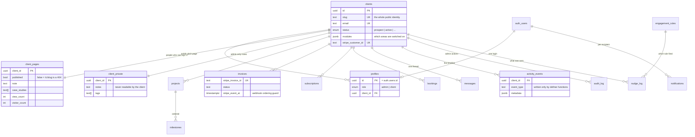

# The data model

Sixteen tables. Everything that belongs to a customer hangs off one
`clients` row, and that is what makes the access rules tractable: almost every
policy in the schema reduces to *"is `client_id` the caller's own?"*

## Why some of it looks redundant

**`client_pages` and `client_private` are separate tables, not columns on
`clients`.** RLS is row-level: a policy can grant or refuse a row, but it
cannot hide one column inside a row it has already granted. A client is allowed
to read their own `clients` row, so anything private living there would have
been readable by them. Splitting the data into tables whose entire policy set
is `admin only` is the only version of this that actually holds.

**`profiles` exists alongside `auth.users`.** Supabase owns `auth.users`;
`profiles` is ours, and it carries the two facts every policy needs — the role
and the client. `role` also lives on the JWT as an `app_metadata` claim, which
is what middleware reads for the fast `/admin` check. The claim is a cache;
`profiles.role` is the source of truth, and RLS checks it again on every query.

**`activity_events` has no client-facing write path.** The engagement score and
the nudges both read from it, so a client who could insert into it could
manufacture the appearance of activity — or suppress a nudge that was about to
tell you they had gone quiet. Every write goes through a `SECURITY DEFINER`
function that decides both the `event_type` and the actor.

**`nudge_log` has a unique `dedupe_key`.** That uniqueness *is* the
at-most-once guarantee. `evaluateNudges()` writes the row before sending, so a
crash mid-send can lose a nudge but can never send it twice — see
`lib/os/nudges/evaluate.ts` for the one case that deliberately rolls the row
back.

## Where the rules live

| Layer | File | What it decides |
|---|---|---|
| Middleware | `middleware.ts` | Session freshness, and `/admin` needs the admin claim |
| Route | `lib/os/client-scope.ts` | Who is looking at `/c/{slug}` and what they see |
| Postgres | `supabase/migrations/*.sql` | RLS on every table; definer functions for writes |

All three have to agree before data reaches a page. The first two are
convenience; the third is the boundary. `.github/workflows/ci.yml` asserts the
third against a real Postgres on every push — including that one client cannot
read another's rows in any of eight tables.
